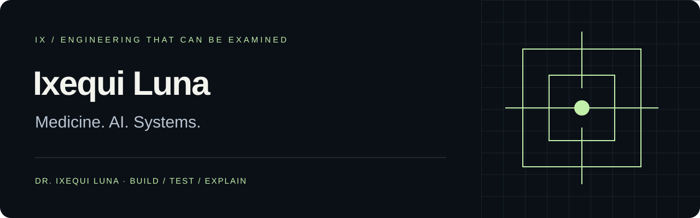

# Construyo sistemas en los que hay que poder confiar.

**Médico. Fundador. Arquitecto de IA que también programa.**

Soy **Dr. Ixequi Luna**, médico cirujano por la BUAP y fundador, CEO & CTO de **Firmus.IA**. Integro criterio clínico, ingeniería de software y responsabilidad empresarial para convertir decisiones complejas en sistemas que se puedan examinar, probar y explicar.

Escribo el código, defino los contratos y acompaño la operación. Trabajo con motores deterministas, interoperabilidad clínica, soberanía de datos y experiencias que explican tanto el resultado como el fallo.

[English](README.md) · [Portafolio](https://ixequiluna.ai) · [LinkedIn](https://www.linkedin.com/in/ixequi-luna/) · [ORCID](https://orcid.org/0009-0000-5436-9389)

## Cinco formas de comprobar el criterio

- **[false-green](https://github.com/ixequiluna-source/false-green):** romper el producto de forma controlada y comprobar si sus pruebas detectan el fallo.
- **[tenant-fence](https://github.com/ixequiluna-source/tenant-fence):** intentar cruzar fronteras entre organizaciones con identidades y datos sintéticos.
- **[telemetry-leak-lab](https://github.com/ixequiluna-source/telemetry-leak-lab):** comprobar qué identificadores conocidos sobreviven a un filtro de telemetría.
- **[health-interop-lab](https://github.com/ixequiluna-source/health-interop-lab):** recorrer contratos clínicos, servicios políglotas y una consola conectada por HTTP y gRPC.
- **[Emotion Detector](https://github.com/ixequiluna-source/oaqjp-final-project-emb-ai):** integración educativa IBM/Coursera con resultados, errores y recuperación visibles.

Cada laboratorio tiene un alcance específico. Una prueba aprobada no equivale a certificación, adopción comercial ni validación clínica.

## Del problema al sistema

Medicina e informática clínica, arquitectura de IA, privacidad y dirección tecnológica con implementación directa. Mi trabajo comercial incluye **Medicus.IA**, **PuestoYa**, **Viajare** y **EmpoweringBiz**; los casos de mi [página personal](https://ixequiluna.ai/#projects) explican su contexto sin exponer código privado.

Mi estándar: reglas trazables, controles que pueden fallar, evidencia suficiente antes de concluir y una interfaz que permita entender y recuperarse.

**Python · TypeScript · Go · SQL · React · Angular · FastAPI · PostgreSQL · Playwright · OpenTelemetry.**

Desde Puebla, México, para proyectos internacionales. Disponible para dirección tecnológica, revisiones de arquitectura y desarrollo especializado en salud y sistemas empresariales.

**[Conversemos](mailto:hello@ixequiluna.ai) · [Conoce mi trabajo](https://ixequiluna.ai)**

Perfil basado en mi CV 2026. Las pruebas y los límites técnicos se documentan por proyecto.
